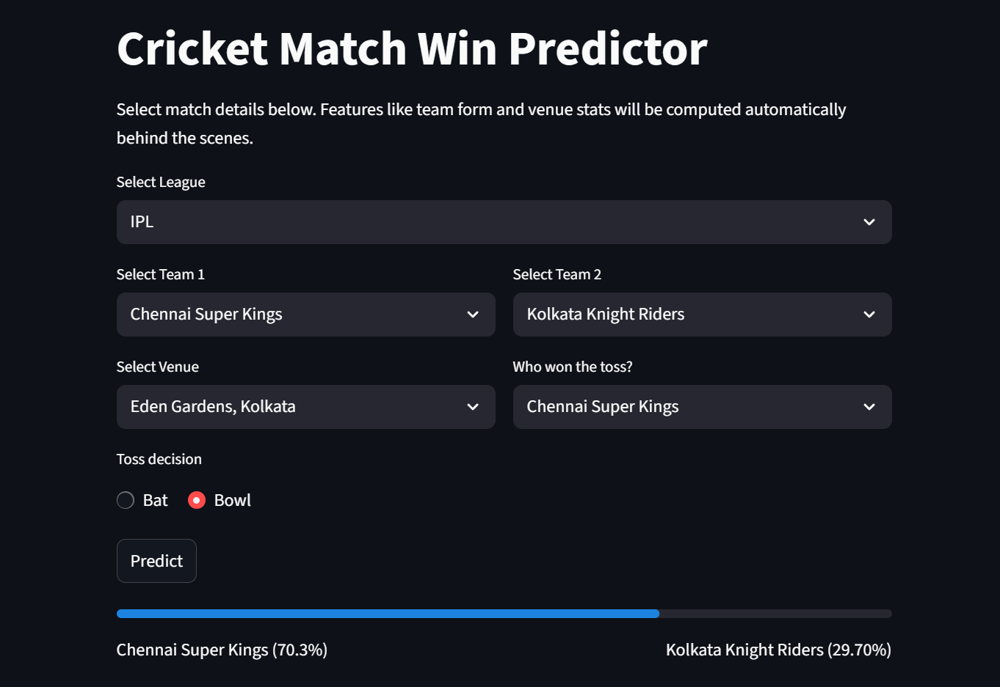

# Cricket ML Predictor

A personal project exploring machine learning models for predicting pre-match win probabilities in franchise T20 cricket. Built as part of a self-directed summer initiative to deepen my understanding of sports analytics, machine learning, and data engineering.

**Note**: This project is intended for educational and experimental purposes only. The predictions are not suitable for betting or professional use.

---

## What's Inside

- **Feature engineering** for recent form, venue advantage, toss impact, and head-to-head performance.
- **Training scripts** for a logistic regression classifier (`src/ml`).
- **Streamlit app** (`app.py`) for making match-day predictions interactively.
- **Integration with Cricsheet data** for processing structured match data (IPL, BBL, T20 Blast).
- **Data conversion script** (`update_data.py`) to convert Cricsheet JSONs into usable CSVs.

---

## Quick Start

Clone the repo and install dependencies:

```bash
git clone https://github.com/your-username/cricket-ml-predictor.git
cd cricket-ml-predictor
pip install -r requirements.txt
streamlit run app.py
```
Requires Python 3.10 or higher. All dependencies (including scikit-learn, streamlit, pandas, numpy, and joblib) are listed in requirements.txt.

---

## Updating Match Data

To add or update match data from Cricsheet:

```bash
python update_data.py path/to/cricsheet/jsons
```

---

## Project Layout

```
cricket-ml-predictor/
├── app.py               # Streamlit frontend
├── data/                # CSV match datasets
├── src/                 # Feature engineering and ML code
│   ├── features/
│   ├── input/
│   ├── ml/
│   ├── objects/
│   └── interface/
└── update_data.py       # Convert Cricsheet data
```

---

## Model Scope

The model performs team-level, pre-match win probability prediction using binary classification (logistic regression). Inputs include form, toss, venue, and head-to-head records. Predictions are presented through an interactive Streamlit interface. 

---

## Example Output

Below is a sample prediction using the Streamlit interface:



---

## Requirements

* Python 3.10+
* pandas
* scikit-learn
* Streamlit
* numpy
* joblib

Install all dependencies via:

```bash
pip install -r requirements.txt
```

---

## Contributing

This is a self-directed learning project, but feedback and suggestions are always welcome. Feel free to open an issue or pull request if you have ideas or spot bugs.

---

## License

Released under the [MIT License](LICENSE).